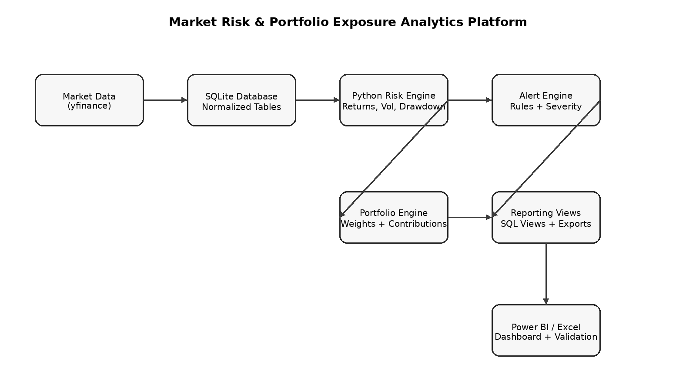
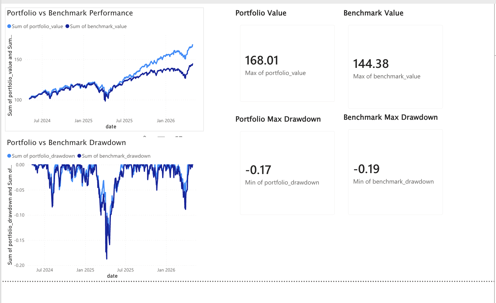
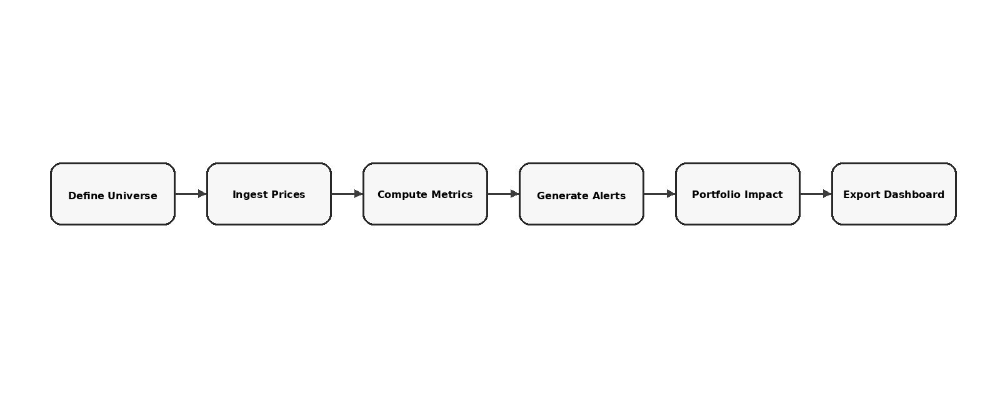
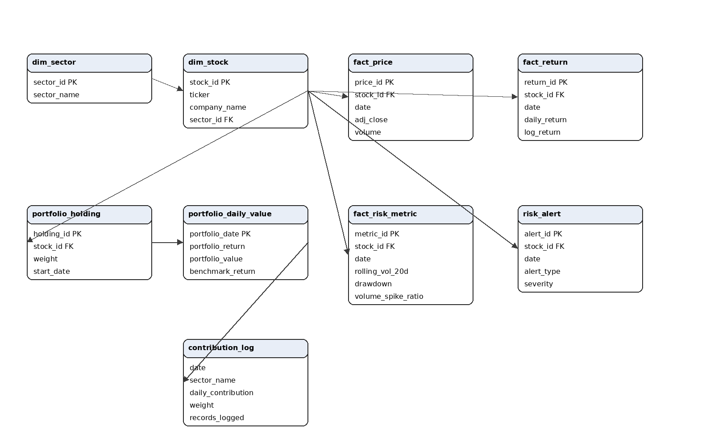

# Market Risk & Portfolio Exposure Analytics Platform



A Python, SQLite, Excel, and Power BI project that builds a full equity risk monitoring and portfolio exposure analytics workflow. The platform ingests stock-market data, stores it in a normalized SQLite database, computes risk metrics, generates rule-based alerts, measures portfolio contribution by stock and sector, exports Power BI-ready tables, and produces an Excel validation workbook.

## Executive Summary

| Item | Description |
|---|---|
| Business problem | Analysts need a clean way to monitor equity risk, detect abnormal market conditions, and explain how stock-level risk affects a portfolio. |
| Solution | End-to-end analytics platform covering ingestion, database design, risk metric calculation, alerting, portfolio attribution, Excel validation, and Power BI reporting. |
| Asset universe | 25 equities across Technology, Financials, Healthcare, Energy, and Industrials. |
| Benchmark | SPY benchmark comparison. |
| Core tools | Python, pandas, NumPy, SQLite, Excel, Power BI. |
| Main output | Dashboard-ready tables, validation workbook, and portfolio/risk reporting views. |

## Dashboard Preview



## What This Project Answers

| Question | Where it is answered |
|---|---|
| Which stocks are currently most volatile? | `latest_stock_risk`, `top_risk_stocks_recent` |
| Which stocks have the deepest drawdowns? | `latest_stock_risk`, `active_alerts_recent` |
| Which alerts should an analyst review first? | `risk_alert`, `active_alerts_recent` |
| Which sectors drive the portfolio? | `sector_portfolio_exposure_latest` |
| Which stocks contribute most to daily portfolio return? | `portfolio_exposure_latest` |
| Did the portfolio beat the benchmark? | `portfolio_vs_benchmark` |
| Were calculations independently checked? | `outputs/market_risk_validation_sample.xlsx` |

## Repository Structure

```text
market-risk-portfolio-analytics-platform/
├── assets/images/                 # Architecture, schema, workflow, and dashboard images
├── dashboards/                    # Power BI dashboard guidance
├── data/                          # Stock universe and portfolio weights
├── docs/                          # Methodology, data dictionary, and dashboard guide
├── outputs/                       # Generated outputs; sample validation workbook included
├── src/
│   ├── data_pipeline/             # Universe setup, price ingestion, database verification
│   ├── risk_metrics/              # Returns, volatility, drawdown, and volume spike logic
│   ├── alerting/                  # Rule-based risk alert engine
│   ├── portfolio_analytics/       # Portfolio returns, exposures, and contribution analysis
│   └── reporting/                 # Benchmark comparison, SQL views, Excel/Power BI exports
├── run_pipeline.py                # One-command project runner
├── requirements.txt
└── README.md
```

## Pipeline Workflow



| Stage | Script | Output |
|---|---|---|
| Universe setup | `src/data_pipeline/portfolio_universe.py` | `dim_sector`, `dim_stock`, `portfolio_holding` |
| Price ingestion | `src/data_pipeline/ingest_prices.py` | `fact_price`, `benchmark_price` |
| Load verification | `src/data_pipeline/verify_load.py` | Data quality report in terminal |
| Return calculation | `src/risk_metrics/compute_returns.py` | `fact_return` |
| Volatility | `src/risk_metrics/compute_volatility.py` | `rolling_vol_20d` metrics |
| Drawdown | `src/risk_metrics/compute_drawdown.py` | stock-level drawdowns |
| Volume spike | `src/risk_metrics/compute_volume_spike.py` | volume spike ratios |
| Alert engine | `src/alerting/alert_engine.py` | `risk_alert` |
| Portfolio engine | `src/portfolio_analytics/portfolio_engine.py` | `portfolio_daily_value` |
| Portfolio exposure | `src/portfolio_analytics/portfolio_exposure.py` | stock/sector contribution views |
| Reporting exports | `src/reporting/run_reporting_pipeline.py` | Power BI CSVs, Excel validation workbook, summary files |

## Data Model



| Table | Purpose |
|---|---|
| `dim_sector` | Sector classification table. |
| `dim_stock` | Ticker, company name, and sector metadata. |
| `fact_price` | Daily OHLCV and adjusted close prices. |
| `fact_return` | Daily simple and log returns. |
| `fact_risk_metric` | Rolling volatility, drawdown, rolling volume, and volume spike indicators. |
| `risk_alert` | Alert events generated from risk rules. |
| `portfolio_holding` | Simulated portfolio weights. |
| `portfolio_daily_value` | Daily portfolio return and benchmark comparison. |
| `contribution_log` | Sector-level contribution history for reporting. |

## Core Metrics

| Metric | Formula / Logic | Business Meaning |
|---|---|---|
| Daily return | `adj_close_today / adj_close_yesterday - 1` | Measures one-day stock performance. |
| Log return | `ln(adj_close_today / adj_close_yesterday)` | Useful for analytical return transformations. |
| 20-day volatility | Rolling standard deviation of daily returns, annualized by `sqrt(252)` | Measures recent market risk. |
| Drawdown | `price / running_peak - 1` | Measures fall from prior high. |
| Volume spike ratio | `today_volume / rolling_20d_average_volume` | Detects abnormal trading activity. |
| Portfolio return | `sum(weight_i × return_i)` | Measures weighted portfolio performance. |
| Contribution to return | `weight_i × return_i` | Shows which holdings drive daily return. |
| Active return | `portfolio_return - benchmark_return` | Measures performance relative to SPY. |

## Alert Engine Logic

| Alert type | Rule | Severity |
|---|---|---|
| `VOL_SPIKE` | 20-day volatility exceeds 1.5× prior rolling volatility baseline | High |
| `DRAWDOWN` | Drawdown worse than -20% | High |
| `VOLUME_SPIKE` | Volume spike ratio above 2.0× | Medium |
| `LARGE_MOVE` | Absolute daily return above 5% | Medium |
| `COMPOSITE` | Two or more individual signals occur on the same stock-date | High |

## How to Run

### 1. Clone or download this repository

```bash
git clone <your-repo-url>
cd market-risk-portfolio-analytics-platform
```

### 2. Create and activate a virtual environment

```bash
python3 -m venv .venv
source .venv/bin/activate
```

### 3. Install packages

```bash
python3 -m pip install -r requirements.txt
```

### 4. Run the full pipeline

```bash
python3 run_pipeline.py
```

This creates a local SQLite database named `stocks.db` and writes reporting outputs to `outputs/`.

### 5. Build the Power BI dashboard

Import the generated file:

```text
outputs/powerbi_exports/*.csv
```

Or use the Excel workbook created from the exports if you prefer one upload into Power BI Web.

## Expected Outputs

| Output | Description |
|---|---|
| `stocks.db` | Local SQLite database generated after the pipeline runs. Not included in GitHub. |
| `outputs/portfolio_vs_benchmark.csv` | Portfolio vs SPY performance table. |
| `outputs/market_risk_validation.xlsx` | Excel validation workbook. |
| `outputs/powerbi_exports/` | Dashboard-ready CSV exports. |
| `outputs/PROJECT_SUMMARY.md` | Auto-generated project summary. |
| `outputs/project_pitch.txt` | Short interview pitch. |

## Dashboard Pages to Build

| Page | Visuals | Tables |
|---|---|---|
| Portfolio vs Benchmark | Performance line chart, drawdown line chart, value/drawdown cards | `portfolio_vs_benchmark` |
| Market Risk Overview | Top volatility stocks, worst drawdowns, recent alerts | `latest_stock_risk`, `top_risk_stocks_recent`, `active_alerts_recent` |
| Portfolio Exposure | Contribution by stock, contribution by sector, portfolio weights | `portfolio_exposure_latest`, `sector_portfolio_exposure_latest` |
| Sector Risk View | Sector volatility, sector drawdown, sector exposure | `sector_risk_summary_latest`, `sector_portfolio_exposure_latest` |

## Project Highlights

- Built a SQLite-backed financial data pipeline for 25 equities across multiple sectors.
- Computed returns, volatility, drawdowns, volume spikes, benchmark performance, and portfolio exposure.
- Generated risk alerts and Power BI-ready reporting tables for market and portfolio monitoring.
- Designed the workflow to support repeatable portfolio risk monitoring and dashboard-ready analysis.

## Notes

- `stocks.db` is intentionally excluded from version control because it is generated locally.
- The sample validation workbook in `outputs/` is included as proof of calculation validation.
- Power BI dashboard files are best stored as screenshots or exported `.pbix` files if using Power BI Desktop.
